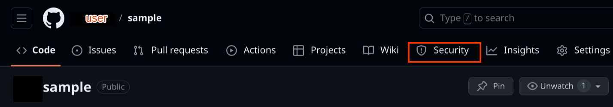
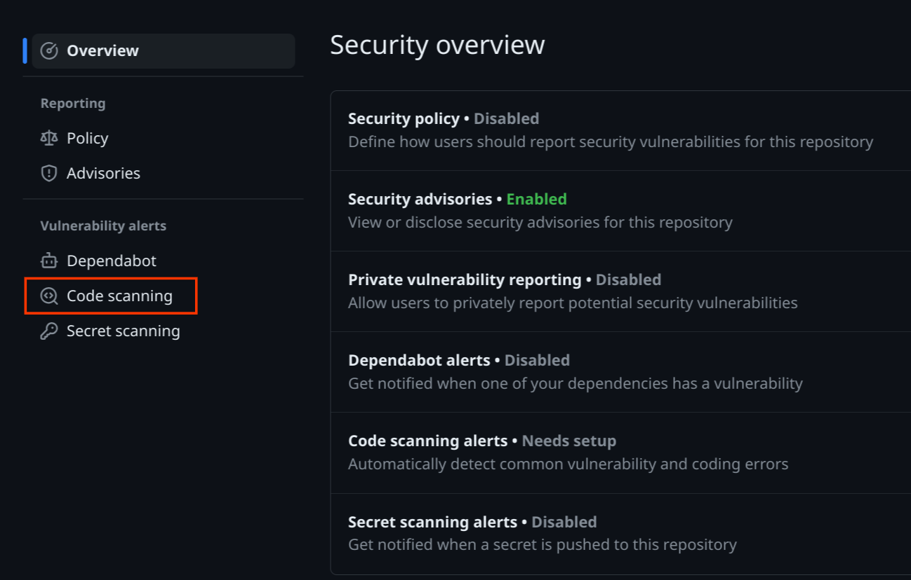
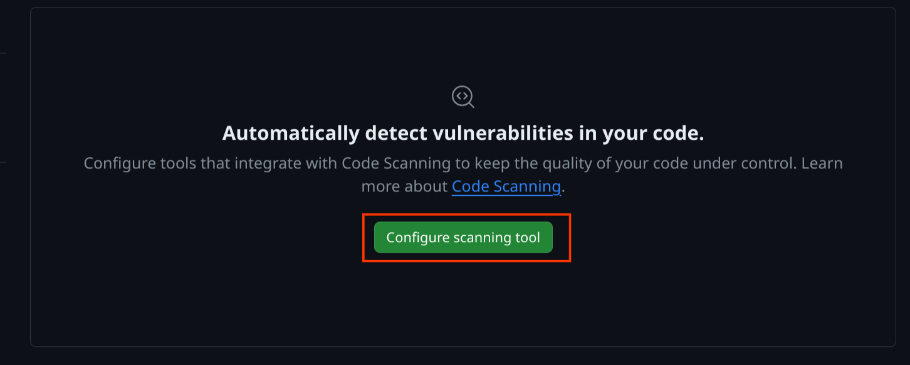
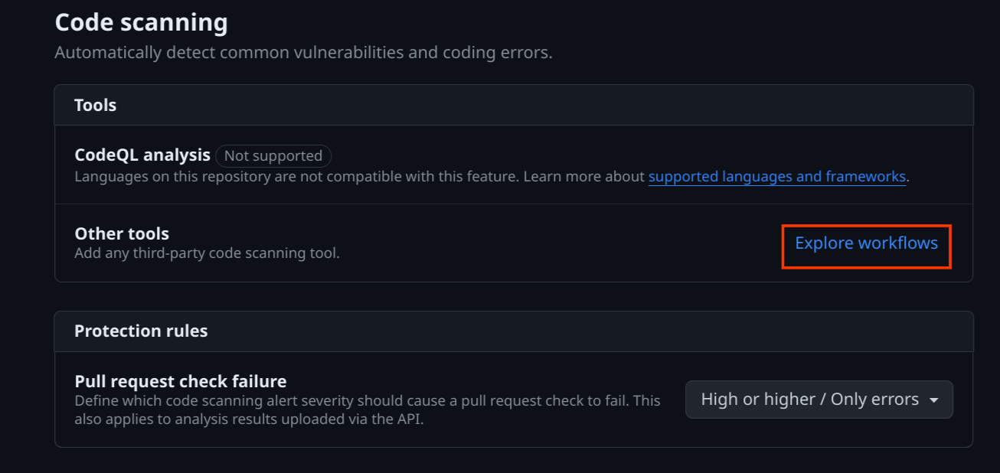

# OSV-Scanner GitHub Action

[OSV-Scanner](www.github.com/google/osv-scanner) offers two GitHub Actions:

1. An action that triggers a scan with each pull request and will only check for new vulnerabilities introduced through the pull request.
2. An action that performs a single vulnerability scan, which can be configured to scan on a regular schedule, or used as a check on releases to prevent releasing with known vulnerabilities in dependencies.

Both actions are free for all repositories. 

________
[OSV-Scanner](#osv-scanner)

[Installation](#installation)
- [Automatic installation](#automatic-installation)
- [Manual installation](#manual-installation)

[Scan on pull request](#scan-on-pull-request)
- [View results](#view-results-1)
- [Customizations](#customizations-1)

[Scheduled scans](#scheduled-scans)
- [View results](#view-results-2)
- [Customizations](#customizations-2)

[Scan on release](#scan-on-release)
- [View results](#view-results-3)
- [Customizations](#customizations-3)

________

## OSV-Scanner
[OSV-Scanner](https://google.github.io/osv-scanner) provides an officially supported frontend to the [OSV database](https://osv.dev) that connects a project’s list of dependencies with the vulnerabilities that affect them. Since the OSV database is open source and distributed, it has several benefits in comparison with closed source advisory databases and scanners:

- Each advisory comes from an open and authoritative source (e.g. the [RustSec Advisory Database](https://github.com/rustsec/advisory-db))
- Anyone can suggest improvements to advisories, resulting in a very high quality database
- The OSV format unambiguously stores information about affected versions in a machine-readable format that precisely maps onto a developer’s list of packages

## Installation

OSV-Scanner can either 

### Automatic installation
1) From your GitHub project's main page, click “Security” tab in the navigation bar.

2) In the "Vulnerability alerts" navigation section, select "Code scanning".

3) Select the "Configure scanning tool" button.

4) In the "Code scanning" section under "Tools" select the "explore workflows" link.

5) 

TODO: insert screenshot
### Manual installation

## Scan on pull request
### View results
### Customizations

## Scheduled scans
### View results
### Customizations

## Scan on release
### View results
### Customizations

