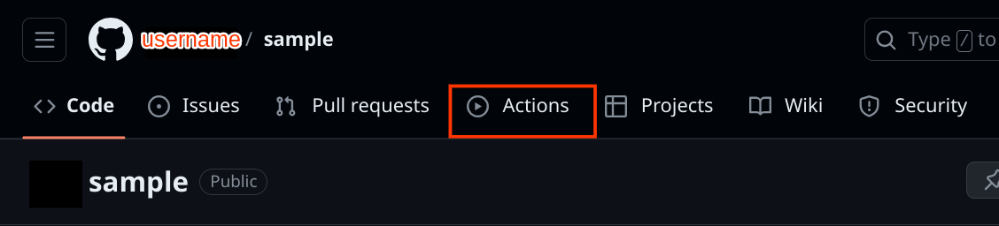
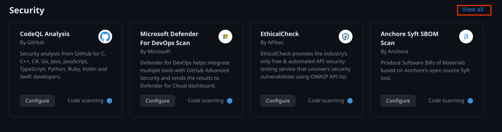

# OSV-Scanner GitHub Action

[OSV-Scanner](www.github.com/google/osv-scanner) offers two GitHub Actions:

1. An action that triggers a scan with each pull request and will only check for new vulnerabilities introduced through the pull request.
2. An action that performs a single vulnerability scan, which can be configured to scan on a regular schedule, or used as a check on releases to prevent releasing with known vulnerabilities in dependencies.

Both actions are free for all repositories. 

________
[OSV-Scanner](#osv-scanner)

[Installation](#installation)
- [Automatic installation](#automatic-installation)
- [Manual installation](#manual-installation)

________

## OSV-Scanner
[OSV-Scanner](https://google.github.io/osv-scanner) provides an officially supported frontend to the [OSV database](https://osv.dev) that connects a project’s list of dependencies with the vulnerabilities that affect them. Since the OSV database is open source and distributed, it has several benefits in comparison with closed source advisory databases and scanners:

- Each advisory comes from an open and authoritative source (e.g. the [RustSec Advisory Database](https://github.com/rustsec/advisory-db))
- Anyone can suggest improvements to advisories, resulting in a very high quality database
- The OSV format unambiguously stores information about affected versions in a machine-readable format that precisely maps onto a developer’s list of packages

## Installation

OSV-Scanner has a primary GitHub action that scans the repository and can be configured to scan on a schedule or on release. OSV-Scanner also has a secondary GitHub Action that performs a scan on pull request and reports newly introduced vulnerabilities. 

The primary GitHub Action can be installed [automatically](#automatic-installation) or [manually](#manual-installation). 

The secondary GitHub Action that runs on pull request must be installed [manually](#manual-installation)

### Automatic installation

1) From your GitHub project's main page, click “Actions” tab in the navigation bar.

2) Scroll to the "Security actions" section and click on "View all". This will take you to a url in the form `https://www.github.com/{username}/{repository}/actions/new?category=security` 

3) Search for "OSV-Scanner". 

4) Choose the "OSV-Scanner" from the list of workflows, and then click “Configure”.

TODO: Insert image

5) Commit the changes.

TODO: Insert image

Follow the [configuration](#configuration) instructions to specify how you want the scanner to work. 

### Manual installation

To manually install a GitHub action, create a new `.yml` file in the `.github/workflows` folder. 

#### Manually install scheduled scan

To manually install the scheduled scan create an `action.yml` file in the `.github/workflows` folder. Include the contents of {TODO link to the appropriate file}. The scheduled scan GitHub Action may also be installed [automatically](#automatic-installation).

#### Manually install pull request scan
To manually install the pull request scan, create an `osv-scanner-pr.yml` file in the `.github/workflows` folder. Include the contents of {TODO link to appropriate files. }

## Configuration
### Scan on pull request
### Scan on schedule
### Scan on release
## View results
### Scan on pull request
### Scan on schedule
### Scan on release